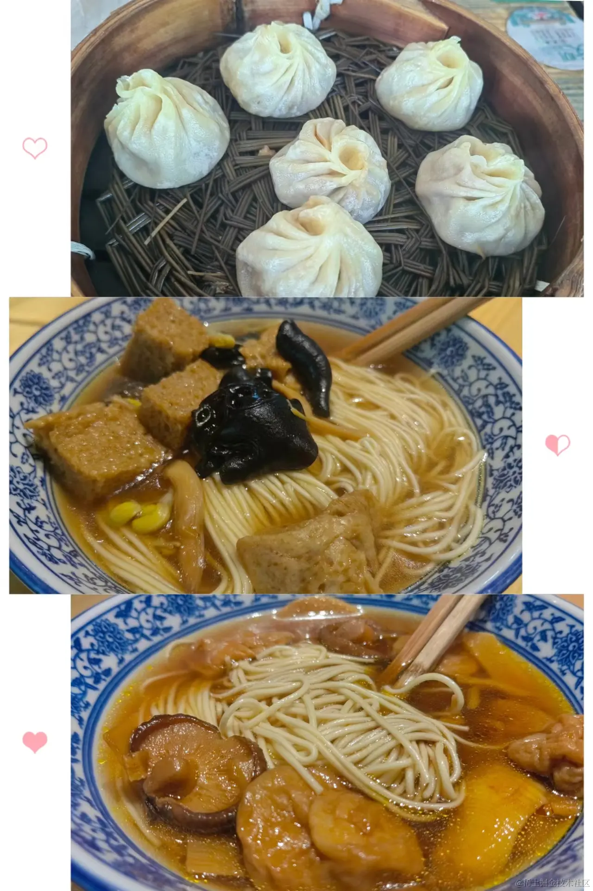
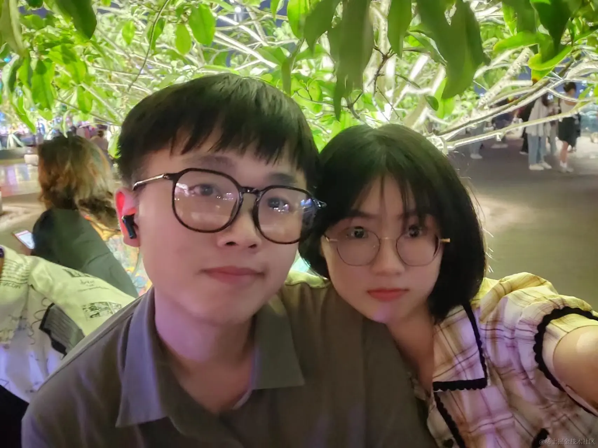
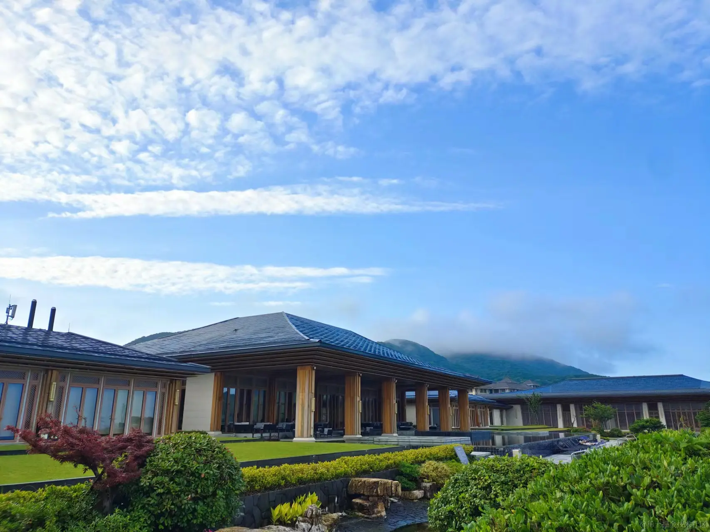
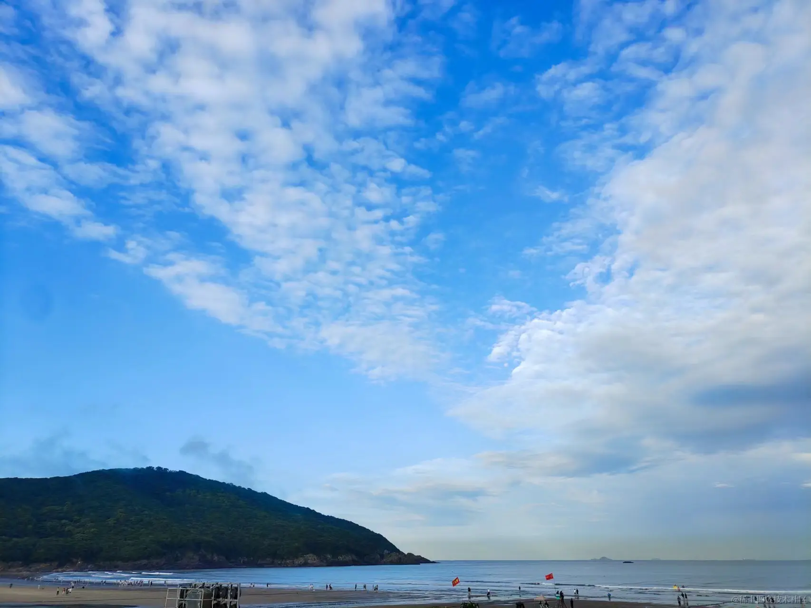
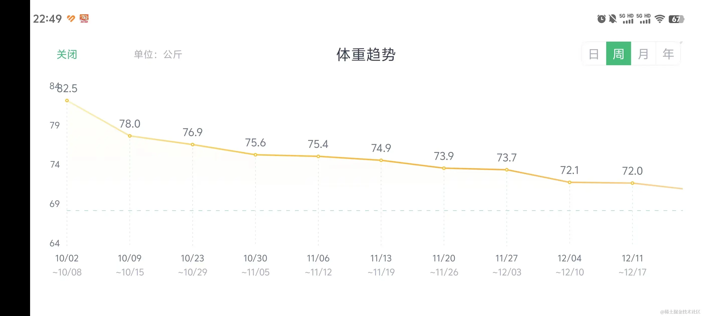
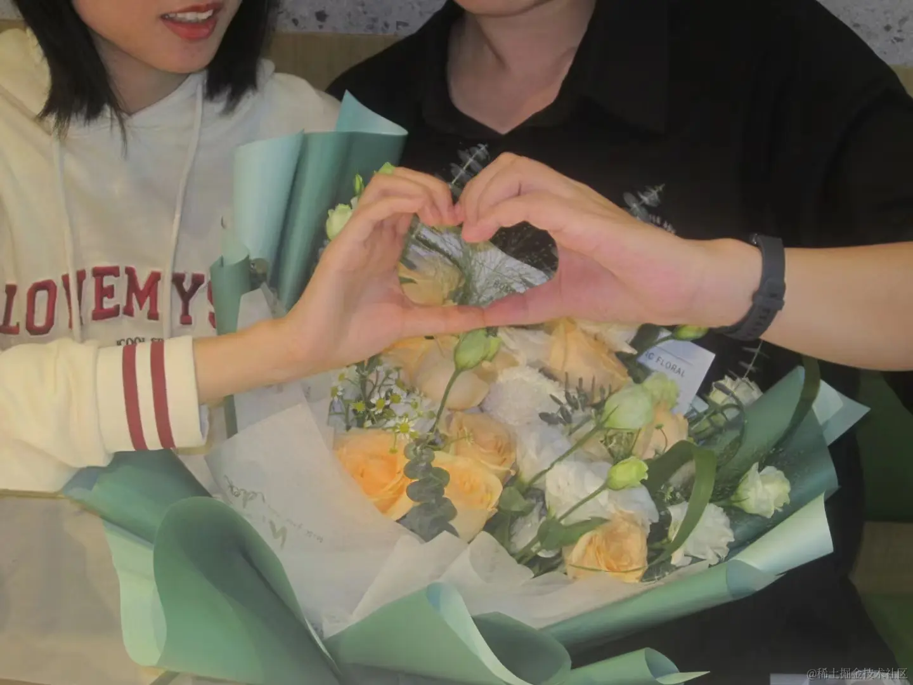

## 前言
好快啊，00后从22年初入职场转眼间就在工位上摸了一年。也好久没写过年度记录了，这里就把摸了一整年的23年记录一下。年度关键词嘛，就是摸鱼、学习、旅游、减肥。

## 工作（摸鱼是常态）

今年工作的主旋律是摸鱼，不是自己想摸，是真的太闲了，没什么工作量给到我。

主要就是在已有平台代码上的功能迭代和 bug 修复；

开发了一个支付宝小程序还有其对应的嵌入到浙里办平台的精简版 H5；

负责即将交付给我们的使用 qiankun 微前端技术的新平台前端代码的开发文档编写（这里被主管拉出去问问题难住了，专门写了一篇文章记录《[主管让我说说 qiankun 是咋回事》](https://juejin.cn/post/7314196310647423039))JY们反馈还不错👻）；

其余时间就是一些零零散散的小开发和主管让进行的技术调研和小demo，前段时间让我去尝试用 AssemblyScript 写 wasm 实现在前端离线加解密，然后发现没有现成的类似 crypto-js 的工具库，想实现得自己拿 AssemblyScript 重写一遍😦，抄了个 JavaScript 的加解密算法写了个小 demo 交代了，主管也知道让我自己写个 AS 的 crypto 有点忒为难我了，就说了再议。（话说再前端wasm里实现加解密真的安全吗？用户在wasm 中解密的过程可以被恶意脚本获取到吗，期待了解这方面的JY解答🧐）。

## 学习（学了就忘的菜）

身在国企，一直有的焦虑就是害怕技术没有长进😕。所以整天想着自己学点什么东西，2022一年，因为刚入职才开始接触React、TypeScript、Next、Taro小程序开发这些，所以平时开发中还挺充实的能学到的不少，平时业务中接触到了一些技术也想着学学什么 Solidity、Golang ，但是没有业务让我这个刚毕业的小前端去用这些技术，过两个月就什么也不会了；

于是我在今年转变思路，我学前端方面的东西总行了吧，然后就：Solid、Svelte、Vue3（Nuxt3）、Angular、Astro、Electron... 我全入了一下门，写了点小demo、小工具。再然后还是没业务做，过了没多久就忘得差不多了；

我还想着去了解了下Nest.js、Flutter、ArkTs这些，结果是 Flutter、ArkTs 这些配环境就给我配恼火了😶‍🌫️，Nest.js 被满眼的装饰器难住了，然后又去了解 TypeScript 装饰器，然后看到了掘金里的使用 TypeScript 做前端OOP开发的，想着自己大学里学的一塌糊涂，像面向对象编程这些思想自己很欠缺，又去到处搜面向对象...... 哈哈哈永远闭环不了了🤣。

## 生活（多图预警）

**流水账式记录😎**

4月，和女朋友去了一次苏州。参观了留园、狮子林、西园寺、“大裤衩”......西园寺的素面还挺好吃的。

6月，公司疗休养在舟山躺了三天😴，酒店风景巨好，居然有沙滩。

9月底，参加了第一次年度体检，盲盒开得惊心动魄，不过除了体脂率和内脏脂肪过高，其他都还好，于是决定十一假期最后放纵一把，收假回来开始减肥。
没想到自己减的还挺快，不到2个月减了20斤😙。

10月，女朋友备考研究生压力太大，住进医院动了个小手术，好在手术顺利赶在生日前出了院，和她室友一起给她庆祝了生日。

12月，陪女朋友在临安考研，青山湖风景很好，就是太冷了🥶。考研随缘了，还好手术后趁着秋招末尾投了几份简历，拿到了一个保底offer。

## 展望（平淡是真，绝不折腾）

展望啥呢，计划赶不上变化，这两年的大环境，看着一起毕业的同学一个个离开杭州，也不想着折腾了，平平淡淡挺好，就希望我爱的人和爱我的人都健健康康。**车到山前必有路，走到哪步算哪步**。先把自己的肥肉减了再说罢！

