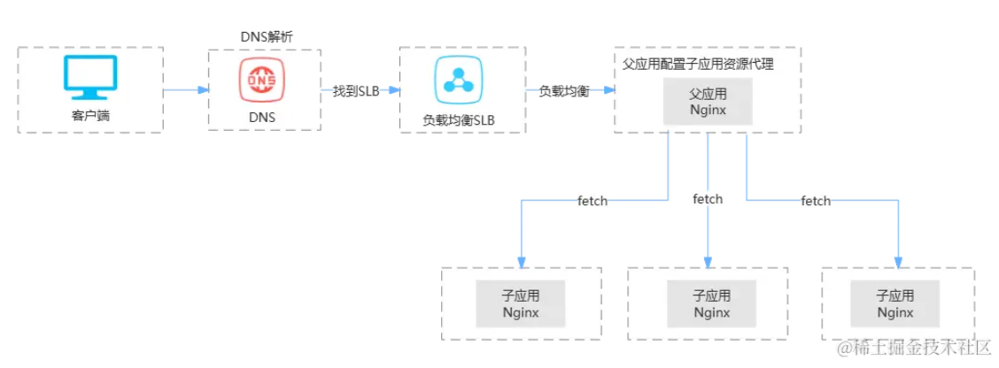
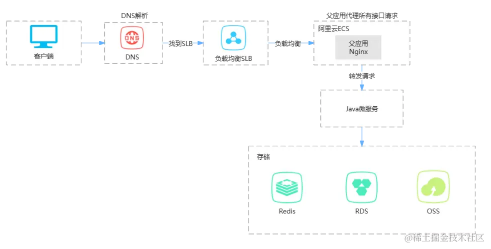

## 前言

最近乙方要移交给我们开发的一个项目的代码，其中前端用到了 qiankun 微前端技术，因为第一版代码之前让我看过，写过基础开发文档，然后主管昨天就找我问了一下，本来以为就是问下具体概念和开发，没想到问起了是怎么实现的🥲，之前了解 qiankun 也就是看了下开发配置，并没有去关注具体实现，一下子给我难住了。

后面又给我留下了几个问题，让我去了解了解，琢磨琢磨，这篇文章就是记一下自己 search 到的一些知识和自己的理解，可能有很多问题，期待JY们指正。

## QA

#### Q：父应用和子应用可以在不同的 nginx 上吗?

A：可以，父子应用既可以在同一个 nginx 也可以在不同的 nginx 上。

#### Q：从SLB过来的请求是先到父应用再路由到子应用?

A：不是，父应用在运行时，通过 fetch 拿到子应用的 html 文件上的 js、css 依赖（import-html-entry），划出一个“独立容器”（sandbox）运行子应用，所有子应用都是运行在父应用这个基座上的“应用级组件”，子应用成为了父应用的一部分，子应用中配置的代理不会生效，父子应用共享同一个网络环境，都运行在同一个IP上，请求都从同一个IP发出，子应用的所有网络请求都通过父应用配置的代理转发。

#### Q：父应用和子应用通信?（是不是通过网络通信）

A：qiankun的父子应用通信不是通过网络通信。

父子应用通信是直接通过浏览器存储或者内存等，例如路由参数、localStorage、eventBus 或者现成的全局状态管理工具都可以管理（我们项目当中使用的 umi 的 useModel）。

子应用挂载时，也可以类似 React 组件通过 props 传递具体数据和父应用中改变数据的函数，也可以传递一个全局状态，其包含变量修改和监听变化的函数，父子应用都可以监听变量的变化和修改变量。

## Nginx配置

父应用上的 nginx 配置类似本地文件中的 proxy 代理配置，在父应用上分别配置每个子应用的 html 文件所在的地址（资源代理），和子应用的后端接口地址（请求代理）。

```typescript
export default {
    "/root-app": {
        target: "https://xxx.xxx.com:xxxx/", 
        changeOrigin: true,
    },

    // child1
    // 资源代理
    "/child1/": {
        target: "https://xxx.xxx.com:xxxx/", 
        changeOrigin: true,
    },
    // 接口代理
    "/child1-api/": {
        target: "https://xxx.xxx.com:xxxx/",
        changeOrigin: true,
    },
    // ......
};
```

**不允许主应用跨域访问微应用**，做法就是将主应用服务器上一个特殊路径的请求全部转发到微应用的服务器上，即通过代理实现“微应用部署在主应用服务器上”的效果。

例如，主应用在 A 服务器，微应用在 B 服务器，使用路径 /app1 来区分微应用，即 A 服务器上所有 /app1 开头的请求都转发到 B 服务器上。此时主应用的 Nginx 代理配置为：

```nginx
/app1/ {
  proxy_pass http://www.b.com/app1/;
  proxy_set_header Host $host:$server_port;
}
```

## 演示图

#### 资源文件

从子应用 html 上解析出 js 和 css 加载到父应用基座

#### 网络请求



## 核心

#### 应用的加载

qiankun 的一个重要的依赖库 import-html-entry ，其功能是主应用拉取子应用 html 中的 js 和 css 文件并加载到父应用基座，**css 嵌入到 html，js放在内存中在适当时机 eval 运行**。

#### 应用的隔离与通信

通过 sandbox 进行 js 和 css 隔离。

##### js 隔离

js 隔离通过给全局 window 一个 proxy 包裹传递进来，子应用的 js 运行在 proxy 上，子应用卸载时，proxy 跟着清除，这样避免了污染真正的 window。另外对于不支持 proxy 的浏览器，没有完美的 polyfill 方案，qiankun 采用 snapshot 快照方案，保存子应用挂载前的 window 状态，在子应用卸载时，恢复到挂载前的状态，但这种解决方案无法处理基座上同时挂载多个子应用的情景；

##### css 隔离

css 隔离通过 shadowdom，将子应用的根节点挂载到 shadowdom 中，shadowdom 内部的样式并不会影响全局样式，但是有个缺点，很多组件库的类似弹窗提醒组件会把 dom 提升到顶层，这样注定会污染到全局的样式；

qiankun 的一个实验性解决方案，类似 vue 的 scoped 方案/css-module，给子应用的 css 变量装饰一下（一般是hash），这样来避免子应用的样式污染到全局。

彻底解决：约定主子应用完全使用不同的 css 命名； react 的 css-in-js 方案；使用 postcss 全局加变量；全部写 tailwindcss  ......

##### 通信

父子应用通信是直接通过浏览器存储或者内存等，例如路由参数、localStorage、eventBus 或者 qiankun 提供的全局状态管理工具都可以管理，**简单来说就是全局变量。**

子应用挂载时，也可以类似React组件通过props传递具体数据和父应用中改变数据的函数，也可以传递一个全局状态，其包含变量修改和监听变化的函数，父子应用都可以监听变量的变化和修改变量。

## 理解

子应用是可以独立开发、独立部署、独立运行的应用，但在父应用上并不是“独立”运行，而是父应用通过网络动态 fetch 到子应用的 html 文件，然后解析出 html 上的 js 和 css 依赖，处理后加载到父应用基座，将子应用作为自己的一个特殊组件加载渲染到一个“独立沙箱容器”中。

## 问题

*   多应用模块共享、代码复用问题没有解决。父子应用如果存在相同依赖，在子应用加载时，是不是还是会去重新加载一遍？

*   子应用 css 隔离仍存在问题，不支持 proxy 的浏览器无法支持多个子应用同时加载的情形；

*   我们该项目所有的应用都是使用 umi 开发的，不存在跨技术栈的问题。当前项目是否真的大到需要使用微前端来增加开发和维护复杂度；

*   根据我的搜索查阅，qiankun 对于 vite 构建的项目支持度貌似不够，而我们最新项目基本都是通过 vite 构建，可能会有问题。
